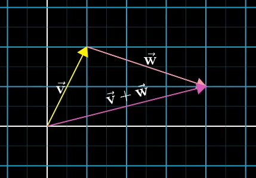
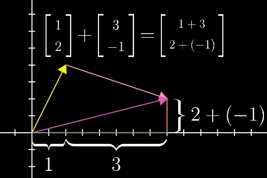
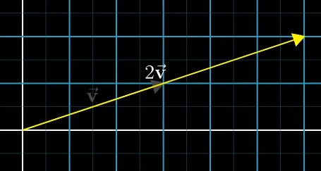
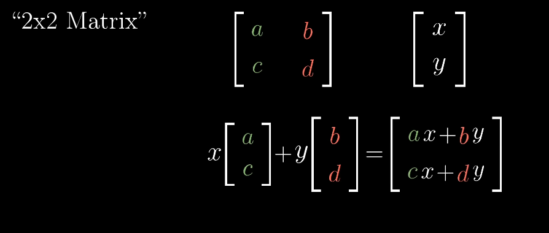
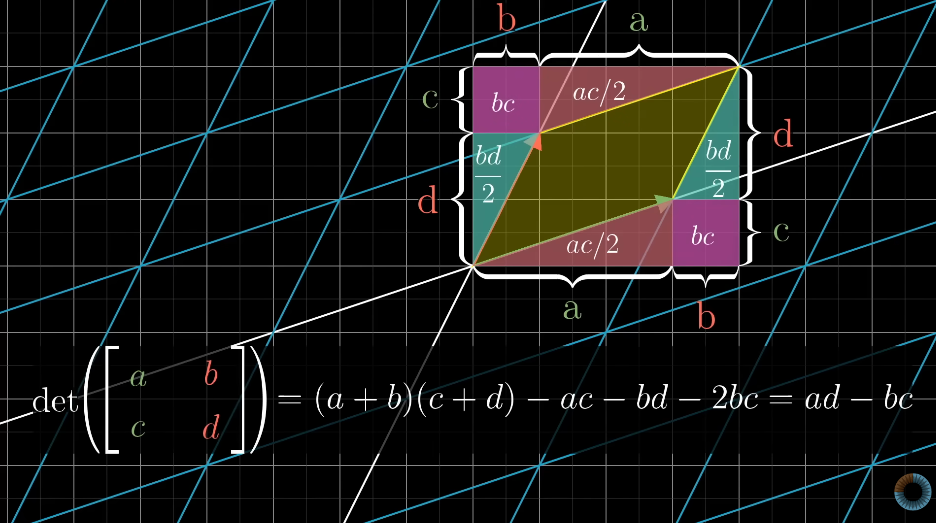
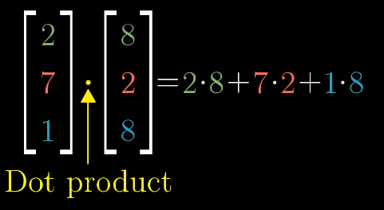
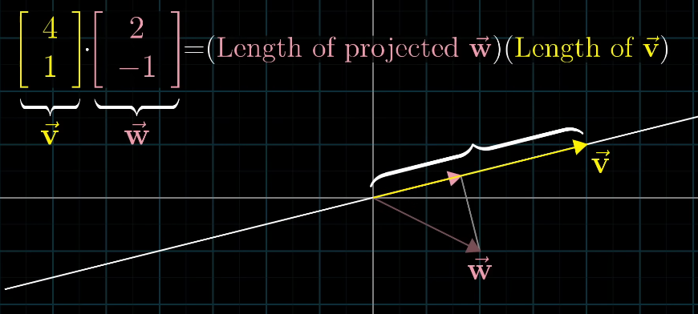
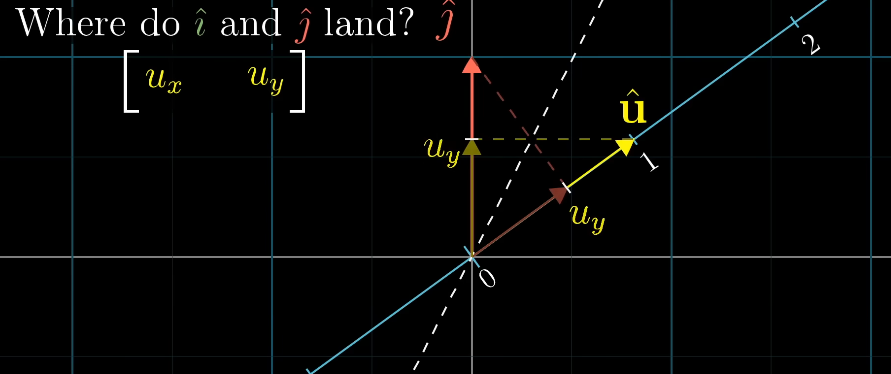
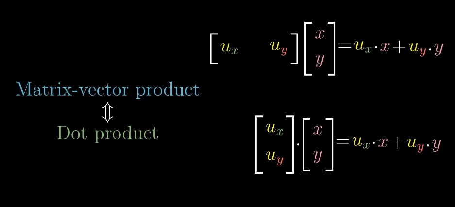

# Notes for the book Ray Tracing in a Weekend

## Contents

1. Overview
2. 3Blue1Brown Linear Algebra

## Overview

This file will contain notes, thought processes and other things that I consider worth writing about during the process of following this book and studying other material along-side it

## 3Blue1Brown Linear Algebra

Watching [Essence of linear algebra](https://youtu.be/fNk_zzaMoSs?si=wAqGKv7hqmLmZFSh) by 3Blue1Brown to learn about linear algebra, mostly vectors.

### Vectors

#### Addittion

#### Multiplication

- This process is called __scaling__.
- The number is called __scalar__.

#### Basis Vectors

- î, ĵ - _basis vectors_ of the xy coordinate system

#### Span

- The "span" of vector1 and vector2 is the set of all their linear combinations.
- a v1 + b v2
- a b - real numbers

#### Linear tranformation

- lines must remain lines
- the origin remains fixed

- _a, c_ describes where _î_ lands and _b, d_ - _ĵ_

#### Matrices

- matrix multiplication is associative - a(bc) = (ab)c
- think of it like applying transformations

#### Determinant

- How much are _areas_ (2d) / __volumes__ (3d) scaled
- the factor which shows how much the areas are scalled is called a __determinant__.

$$
\det \left( \begin{bmatrix} \color{green}a & \color{red}b \\ \color{green}c & \color{red}d \end{bmatrix} \right) = \color{green}a\color{red}d - \color{red}b\color{green}c
$$

- det(M1M2) = det(M1)det(M2)

#### Invers transformation

- det(A) != 0
- A^-1

$$
A^{-1}A = \begin{bmatrix} 1 & 0 \\ 0 & 1 \end{bmatrix}
$$

- Identity matrix - a transformation that does nothing

- "Rank" - number of _dimensions_ in the output of a transformation

#### Dot Products

- if the second projection is in the oposite direction, the dot product should be negative

- order doesn't matter

- dot product is useful geometric tool for understanding __projections__ and if 2 vectors are pointing in the same direction

## Book Notes
### Outputting an image

- PPM image format [wiki](https://en.wikipedia.org/wiki/Netpbm)